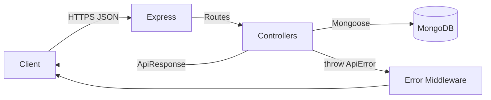
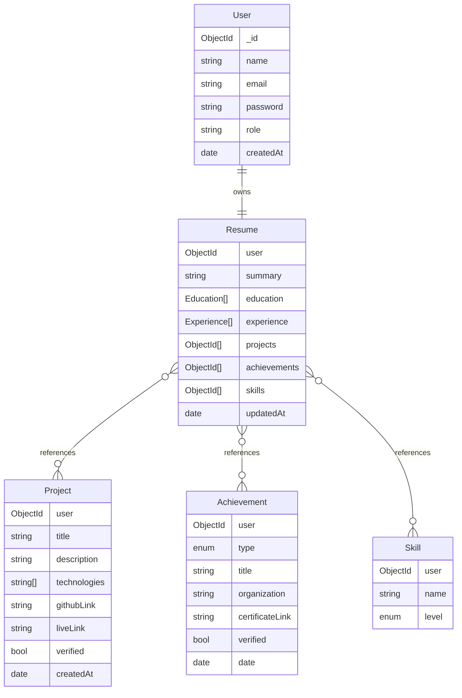
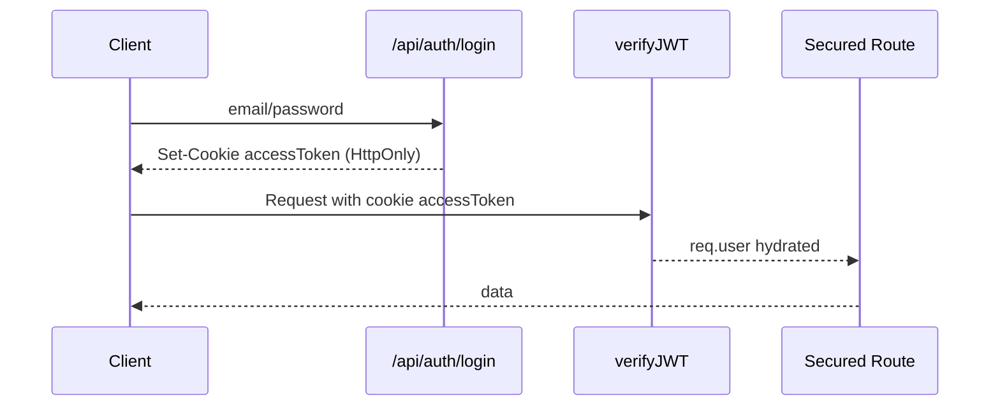
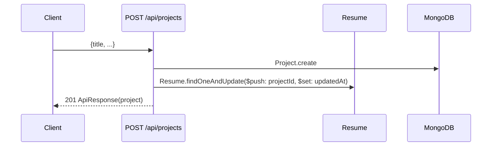

## Resume System – Dynamic Resume Builder and Verification Platform

Build modern resumes programmatically. This backend provides secure authentication, CRUD for projects/achievements/skills, automatic resume maintenance, verification of items, and insights—all powered by Node.js, Express, and MongoDB.

### Key Features
- **JWT auth**: Register/Login with hashed passwords and stateless tokens
- **Modular CRUD**: Projects, Achievements, Skills with verification flags
- **Auto-maintained Resume**: `Resume` embeds arrays of references and updates on every change
- **Analytics/Insights**: Quick stats of verified/unverified items per user
- **Robust DX**: `ApiError`, `ApiResponse`, and `asyncHandler` for clean APIs

---

### Table of Contents
- [Introduction](#introduction)
- [System Architecture](#system-architecture)
- [Models and Database Schema](#models-and-database-schema)
- [API Endpoints](#api-endpoints)
- [Authentication Flow](#authentication-flow)
- [Resume Update Logic](#resume-update-logic)
- [Error and Response Handling](#error-and-response-handling)
- [Verification System](#verification-system)
- [Resume Insights Endpoint](#resume-insights-endpoint)
- [Future Scope](#future-scope)
- [Setup and Run](#setup-and-run)

---

### Introduction
**Problem**: Manually maintaining resumes across projects, courses, and achievements is error-prone and time-consuming.

**Solution**: A backend that lets users securely manage portfolio data. As users add items, their `Resume` is updated in real time. Admin/verifiers can mark items as verified. Consumers can fetch the full resume or high-level stats.

**Feature Overview**
- Auth: Register, Login (JWT); role support (`student`, `admin`)
- Resume: Summary, education, experience, and references to projects/achievements/skills
- Projects/Achievements/Skills: CRUD with `verified` flags
- Verification: Role-protected endpoint to mark items verified
- Insights: Aggregated counts (verified/unverified)

---

### System Architecture
High-level flow: client → REST API → controllers → services/model ops → MongoDB. Error handling is centralized.



Tech stack:
- Node.js, Express.js
- MongoDB with Mongoose
- JWT for auth
- Utilities: `ApiError`, `ApiResponse`, `asyncHandler`

Folder structure (key parts):
```
DB/
middlewares/
models/
controllers/
routes/
utils/
index.js
```

---

### Models and Database Schema
Relationships: `User` 1—1 `Resume`; `Resume` holds refs to `Project`, `Achievement`, and `Skill` arrays.



---

### API Endpoints
Base URL: `/api`

Authentication
- POST `/auth/register`
  - Headers: `Content-Type: application/json`
  - Body:
    ```json
    { "name": "Asjad Dawre", "email": "asjad@example.com", "password": "secret123" }
    ```
  - 201 Response:
    ```json
    { "statusCode": 201, "data": { /* user */ }, "message": "User registered successfully", "success": true }
    ```

- POST `/auth/login`
  - Body:
    ```json
    { "email": "asjad@example.com", "password": "secret123" }
    ```
  - 200 Response:
    ```json
    { "statusCode": 200, "data": { "token": "<JWT>", "user": { /* user */ } }, "message": "Login successful", "success": true }
    ```

Projects (cookie-based auth; httpOnly cookie `accessToken` is set by login)
- POST `/projects`
  - Body:
    ```json
    { "title": "Portfolio", "description": "Site", "technologies": ["React","Node"], "githubLink": "...", "liveLink": "..." }
    ```
  - 201 Response: project created and resume updated
- GET `/projects`
  - 200 Response: list of user projects
- PUT `/projects/:projectId`
  - Body: partial update (e.g., `{ "verified": true }` by verifier)
  - 200 Response: updated project and resume `updatedAt`
- DELETE `/projects/:projectId`
  - 200 Response: deleted and removed from resume

Achievements (requires auth)
- POST `/achievements`
- GET `/achievements`
- PUT `/achievements/:achievementId`
- DELETE `/achievements/:achievementId`

Skills (requires auth)
- POST `/skills`
- GET `/skills`
- PUT `/skills/:skillId`
- DELETE `/skills/:skillId`

Resume (requires auth)
- GET `/resume` — returns populated resume (projects, achievements, skills)
- PUT `/resume/summary` — `{ "summary": "..." }`
- PUT `/resume/education` — `{ "education": [ {"institute":"...","degree":"...","startYear":2022,"endYear":2026} ] }`
- PUT `/resume/experience` — `{ "experience": [ {"title":"SWE Intern","company":"X","duration":"Jun-Sep","description":"..."} ] }`
- GET `/resume/stats` — insights of verified/unverified counts

Verification (requires auth; typically elevated role)
- PUT `/verify/:type/:id` — `type` in `[project, achievement, skill, course]`
  - 200 Response: item marked `verified: true`

---

### Authentication Flow
1. On login, server validates credentials and sets an httpOnly cookie `accessToken` (7d expiry).
2. Client does not manually handle the token; the browser sends the cookie automatically (with credentials enabled).
3. `verifyJWT` middleware reads the token from cookies and injects `req.user` for protected routes.



---

### Resume Update Logic
When creating/updating/deleting a Project/Achievement/Skill:
- Create/Update/Delete the item document
- Update `Resume` accordingly (`$push`/`$pull`, set `updatedAt`)
- For summary/education/experience: the resume document is updated in place

Example lifecycle (create project):


---

### Error and Response Handling
- Use `asyncHandler` to catch rejections and forward to the error middleware
- Throw `ApiError(message, statusCode)` inside controllers
- Always respond with `new ApiResponse(statusCode, data, message)` on success

Example error shape:
```json
{ "statusCode": 400, "data": null, "message": "Project title is required", "success": false }
```

---

### Verification System
Endpoint: `PUT /api/verify/:type/:id`
- Valid `type`: `project | achievement | skill | course`
- Sets `verified = true` on the target document
- Can be guarded by role checks (extend `verifyJWT` or add role middleware)

---

### Resume Insights Endpoint
Endpoint: `GET /api/resume/stats`
- Computes counts from user’s items
- Response example:
```json
{
  "statusCode": 200,
  "data": {
    "totalProjects": 3,
    "verifiedProjects": 1,
    "totalAchievements": 2,
    "verifiedAchievements": 2,
    "totalSkills": 5,
    "verifiedSkills": 3
  },
  "message": "Resume stats fetched successfully",
  "success": true
}
```

---

### Future Scope
- AI-generated resume summary and skills extraction
- Integrations: Udemy, Coursera, Hackathons, GitHub activity
- Resume export: PDF generator and templates

---

### Setup and Run
Prerequisites
- Node.js 18+
- MongoDB instance

Install
```bash
npm install
```

Environment
Create a `.env` file:
```bash
PORT=5000
DB_URL=mongodb://localhost:27017
DB_Name=resumesys
JWT_SECRET=supersecretkey
```

Run
```bash
node index.js
```

Testing with Postman / curl (cookies)
- Set base URL to `http://localhost:5000/api`
- Ensure you send/receive cookies:
  - Postman: Enable "Send cookies" and turn on "Enable cookie management"; also set "Follow original HTTP method" for redirects if prompted. For CORS, your frontend client should use `withCredentials`.
  - curl: store cookies on login and resend them:
    ```bash
    # Login (store cookies)
    curl -i -c cookiejar.txt -X POST http://localhost:5000/api/auth/login \
      -H "Content-Type: application/json" \
      -d '{"email":"tester@example.com","password":"secret123"}'

    # Authenticated request (sends cookie)
    curl -s -b cookiejar.txt http://localhost:5000/api/projects
    ```

---

### Docker (Local) – Backend + MongoDB

Files included:
- `Dockerfile` – Node.js LTS base, installs deps, runs `npm run dev`
- `docker-compose.yml` – services: `backend`, `mongo` with volume and healthcheck
- `.dockerignore` – excludes `node_modules`, logs, and env files

Create `.env` for Docker/Local:
```bash
PORT=5000
DB_URL=mongodb://mongo:27017
DB_Name=ResumeSys
JWT_SECRET=supersecretkey
```

Build and run:
```bash
docker-compose build
docker-compose up
```

Access:
- Backend: `http://localhost:5000/` (health) and `http://localhost:5000/api`
- Mongo shell (optional):
  - Install mongosh locally, then: `mongosh mongodb://localhost:27017/ResumeSys`

Switching to MongoDB Atlas:
- Update `.env`:
  - `DB_URL=mongodb+srv://<user>:<pass>@<cluster>.mongodb.net`
  - `DB_Name=ResumeSys`
- Leave ports/compose unchanged; backend will connect to Atlas instead of the local `mongo` service.

Key commands and expected outputs
```bash
# 1) Build images
docker compose build
# Expected: build completes without error, shows "Successfully tagged resumesys-backend" (or similar)

# 2) Start in background
docker compose up -d
# Expected: containers created: resumesys-backend, resumesys-mongo (status: Up)

# 3) Check containers
docker ps
# Expected lines:
# resumesys-backend   0.0.0.0:5000->5000/tcp   Up
# resumesys-mongo     0.0.0.0:27017->27017/tcp Up

# 4) Tail backend logs
docker logs -f resumesys-backend
# Expected lines include:
# App listening at 5000
# Connected to ResumeSys

# 5) Probe health route
curl http://localhost:5000/
# Expected: "Resume System Backend Running..." or "Helllo from backend"

# 6) Register and Login (cookies)
curl -s -X POST http://localhost:5000/api/auth/register \
  -H "Content-Type: application/json" \
  -d '{"name":"Tester","email":"tester@example.com","password":"secret123"}'
# Expected: statusCode 201 with user object

curl -i -X POST http://localhost:5000/api/auth/login \
  -H "Content-Type: application/json" \
  -d '{"email":"tester@example.com","password":"secret123"}' \
  -c cookiejar.txt
# Expected: 200 with Set-Cookie: accessToken=...

# 7) Use cookie to access protected route
curl -s -b cookiejar.txt http://localhost:5000/api/projects
# Expected: statusCode 200 and an empty array [] initially (wrapped in ApiResponse)

# 8) Mongo shell (requires mongosh)
mongosh "mongodb://localhost:27017/ResumeSys" --eval "db.getCollectionNames()"
# Expected: collections like [ "users", "resumes", "projects", "achievements", "skills" ] after usage
```

Troubleshooting
- If the backend connects to Atlas instead of Docker Mongo, ensure `.env` has `DB_URL=mongodb://mongo:27017` and `DB_Name=ResumeSys` before `docker compose up`.
- If ports are busy, change `5000:5000` or `27017:27017` in `docker-compose.yml`.
- Restart sequence: `docker compose down && docker compose up -d`.


### Conclusion
This backend centers on clarity, safety, and maintainability. It is well-suited for student portfolios, campus platforms, or any system that needs dynamic resume data with verification and insights.


