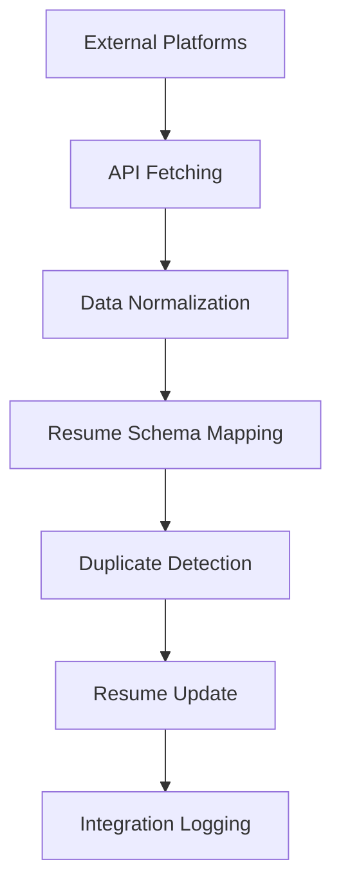
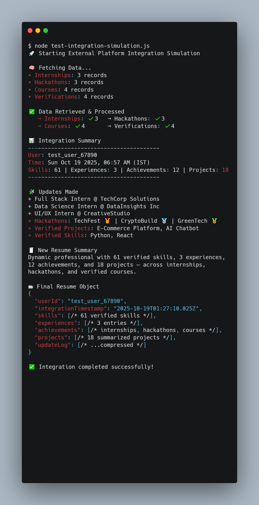

# External Platform Integration System

## Table of Contents
- [Overview](#overview)
- [Architecture](#architecture)
  - [Core Components](#core-components)
  - [File Structure](#file-structure)
- [Supported Platforms](#supported-platforms)
  - [Internship & Training Platforms](#1-internship--training-platforms)
  - [Hackathon Platforms](#2-hackathon-platforms)
  - [Online Learning Platforms](#3-online-learning-platforms)
  - [Verification Modules](#4-verification-modules)
- [Data Flow](#data-flow)
- [Integration Process](#integration-process)
  - [Data Fetching](#1-data-fetching)
  - [Data Normalization](#2-data-normalization)
  - [Resume Schema Mapping](#3-resume-schema-mapping)
  - [Duplicate Prevention](#4-duplicate-prevention)
- [Usage](#usage)
  - [Running the Simulation](#running-the-simulation)
  - [Test Scripts](#test-scripts)
- [Sample Output](#sample-output)
  - [Test Script Descriptions](#test-script-descriptions)
- [Future API Integration](#future-api-integration)
- [Data Models](#data-models)
  - [Internship Data](#internship-data)
  - [Hackathon Data](#hackathon-data)
  - [Course Data](#course-data)
  - [Verification Data](#verification-data)
- [Benefits](#benefits)
- [Security Considerations](#security-considerations)
- [Performance Optimization](#performance-optimization)
- [Monitoring and Logging](#monitoring-and-logging)
- [Future Enhancements](#future-enhancements)
- [Conclusion](#conclusion

## Overview

The External Platform Integration System simulates how our Resume Builder backend would automatically pull, normalize, and merge data from various external learning and achievement platforms into a unified resume schema. This system demonstrates the architecture for real-time resume updates based on external platform activities.

## Architecture

### Core Components

1. **UnifiedIntegrationEngine** - Main orchestrator class
2. **Mock Data Sources** - Simulated external platform data
3. **Data Normalization** - Converts platform-specific data to unified format
4. **Resume Merging** - Updates resume sections with new data
5. **Future API Adapters** - Stubs for real API integrations

### File Structure

```
models/
├── integrationSimulation.js     # Main integration engine
utils/mockData/
├── internships.js              # Internship platform data
├── hackathons.js               # Hackathon platform data
├── courses.js                  # Course platform data
└── verifications.js            # Verification module data
test-integration-simulation.js  # Comprehensive test and demo script
debug-test.js                   # Debug test for troubleshooting
simple-test.js                  # Simple test for basic verification
```

## Supported Platforms

### 1. Internship & Training Platforms
- **Internshala** - Internship opportunities and certificates
- **LinkedIn Learning** - Professional development courses
- **Indeed** - Job training and internships

### 2. Hackathon Platforms
- **Devpost** - Hackathon competitions and projects
- **HackerEarth** - Coding competitions and challenges

### 3. Online Learning Platforms
- **Coursera** - University-level courses and specializations
- **Udemy** - Professional skill development courses
- **edX** - Academic courses from top universities

### 4. Verification Modules
- **GitHub Verified** - Project code quality verification
- **Skill Assessment Pro** - Automated skill testing
- **Project Validator** - Peer-reviewed project validation
- **Code Review Central** - Portfolio-based skill verification

## Data Flow



## Integration Process

### 1. Data Fetching
- Parallel API calls to all connected platforms
- Simulated delays to mimic real API responses
- Error handling for failed requests

### 2. Data Normalization
- Platform-specific data converted to unified format
- Skill extraction and categorization
- Date standardization and validation

### 3. Resume Schema Mapping
- **Skills**: Extracted from all platforms, deduplicated
- **Experience**: Internships mapped to experience section
- **Achievements**: Courses, hackathons, verifications as achievements
- **Projects**: Hackathon projects and verified projects

### 4. Duplicate Prevention
- Skills deduplication using case-insensitive matching
- Project uniqueness based on title and description
- Achievement verification to prevent duplicates

## Usage

### Running the Simulation

```javascript
import { simulateIntegration } from './models/integrationSimulation.js';

// Run simulation for a user
const results = await simulateIntegration('user_12345');
console.log(results);
```

### Test Scripts

**Main Test Script (Comprehensive):**
```bash
node test-integration-simulation.js
```

**Debug Test (Troubleshooting):**
```bash
node debug-test.js
```

**Simple Test (Basic Verification):**
```bash
node simple-test.js
```

## Sample Output

The simulation produces a comprehensive report showing:

- **Statistics**: Total skills, experiences, achievements, projects
- **Update Log**: Detailed list of all changes made
- **Skills Breakdown**: Categorized by technology type
- **Experience Summary**: All professional experiences
- **Achievement Analysis**: Grouped by achievement type
- **Project Portfolio**: Organized by project type



### Test Script Descriptions

- **test-integration-simulation.js**: Full-featured test with detailed analysis, skills categorization, and comprehensive reporting
- **debug-test.js**: Debug-focused test for troubleshooting integration issues with error handling and stack traces
- **simple-test.js**: Minimal test for quick verification of basic functionality and import success

## Future API Integration

The system includes adapter stubs for real API integrations:

```javascript
// Future real API adapters
export const InternshalaAPIAdapter = {
  async fetchUserInternships(userId, apiKey) {
    // Real API implementation
  }
};

export const DevpostAPIAdapter = {
  async fetchUserHackathons(userId, apiKey) {
    // Real API implementation
  }
};
```

## Data Models

### Internship Data
```javascript
{
  id: "int_001",
  platform: "Internshala",
  title: "Full Stack Development Intern",
  organization: "TechCorp Solutions",
  duration: "3 months",
  skillsGained: ["React", "Node.js", "MongoDB"],
  certificateURL: "https://...",
  verifiedBy: "Internshala"
}
```

### Hackathon Data
```javascript
{
  id: "hack_001",
  platform: "Devpost",
  title: "AI Innovation Challenge",
  position: "1st Place",
  prize: "$5000",
  projectTitle: "SmartVision - AI-Powered Accessibility Tool",
  technologies: ["Python", "TensorFlow", "OpenCV"],
  githubLink: "https://github.com/...",
  demoLink: "https://demo.com"
}
```

### Course Data
```javascript
{
  id: "course_001",
  platform: "Coursera",
  title: "Machine Learning Specialization",
  organization: "Stanford University",
  instructor: "Andrew Ng",
  grade: "98%",
  skillsGained: ["Machine Learning", "Python", "Neural Networks"],
  certificateURL: "https://coursera.org/verify/..."
}
```

### Verification Data
```javascript
{
  id: "verify_001",
  platform: "GitHub Verified",
  type: "project",
  title: "E-commerce Platform",
  verificationMethod: "code_review",
  qualityScore: 9.2,
  skillsVerified: ["React", "Node.js", "MongoDB"],
  githubLink: "https://github.com/..."
}
```

## Benefits

1. **Automated Updates**: Resume automatically updates when users complete activities
2. **Comprehensive Coverage**: Integrates multiple platform types
3. **Skill Tracking**: Centralized skill management across platforms
4. **Verification**: Ensures data authenticity through platform verification
5. **Scalability**: Modular design allows easy addition of new platforms
6. **Real-time**: Immediate updates when external activities are completed

## Security Considerations

- API keys and tokens stored securely
- Data validation and sanitization
- Rate limiting for API calls
- Error handling and fallback mechanisms
- User consent for data integration

## Performance Optimization

- Parallel API calls for faster data fetching
- Caching mechanisms for frequently accessed data
- Incremental updates to avoid full data refresh
- Background processing for non-critical updates

## Monitoring and Logging

- Comprehensive integration logs
- Performance metrics tracking
- Error monitoring and alerting
- User activity analytics
- Platform API health monitoring

## Future Enhancements

1. **Real API Integrations**: Connect to actual platform APIs
2. **Machine Learning**: AI-powered skill matching and recommendations
3. **Social Integration**: LinkedIn, GitHub profile synchronization
4. **Advanced Analytics**: Skill gap analysis and career insights
5. **Mobile Integration**: Mobile app platform connections
6. **Blockchain Verification**: Decentralized credential verification

## Conclusion

This integration system provides a robust foundation for automatically updating resumes based on external platform activities. The modular architecture ensures easy extensibility while maintaining data integrity and user privacy. The simulation demonstrates the complete workflow and serves as a blueprint for production implementation.
