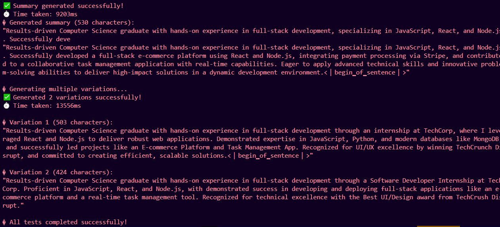
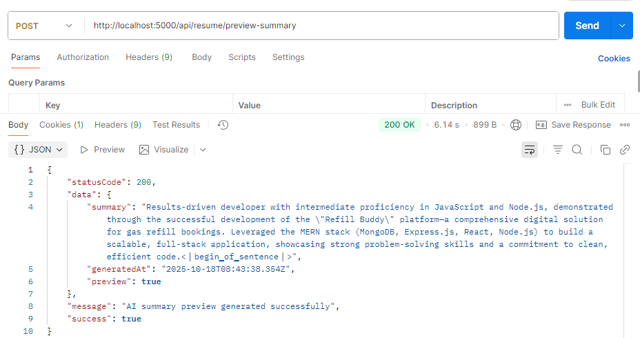
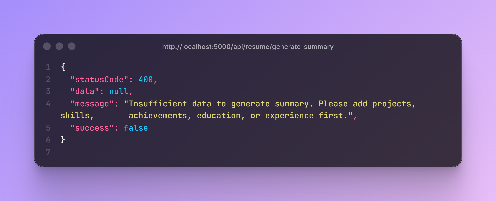
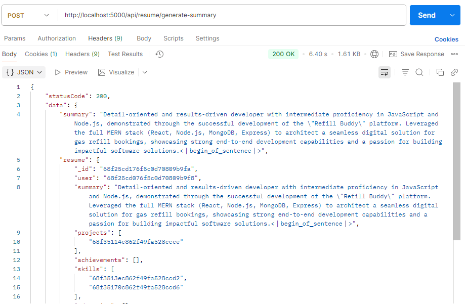

# OpenRouter DeepSeek V3.1 Integration for Resume Summary Generator

## Overview

The AI Resume Summary Generator has been updated to use OpenRouter's DeepSeek V3.1 model (free tier) instead of GitHub AI. This provides a cost-effective and high-quality solution for generating professional resume summaries.

# Table of Contents

- [Overview](#overview)
- [Key Features](#key-features)
  - [🆓 Free DeepSeek V3.1 Model](#-free-deepseek-v31-model)
  - [🔧 Technical Features](#-technical-features)
- [Setup Instructions](#setup-instructions)
  - [Get OpenRouter API Key](#1-get-openrouter-api-key)
  - [Environment Configuration](#2-environment-configuration)
  - [Install Dependencies](#3-install-dependencies)
- [API Usage](#api-usage)
  - [Endpoints (Unchanged)](#endpoints-unchanged)
  - [Query Parameters (Unchanged)](#query-parameters-unchanged)
  - [Example Usage](#example-usage)
- [Technical Implementation](#technical-implementation)
  - [Model Configuration](#model-configuration)
  - [API Call Structure](#api-call-structure)
  - [Client Configuration](#client-configuration)
- [Error Handling](#error-handling)
  - [Common Error Scenarios](#common-error-scenarios)
- [Performance Characteristics](#performance-characteristics)
- [Testing](#testing)
  - [Test Script](#test-script)
  - [Expected Output](#expected-output)
- [Migration from GitHub AI](#migration-from-github-ai)
  - [What Changed](#what-changed)
  - [What Stayed the Same](#what-stayed-the-same)
- [OpenRouter Features](#openrouter-features)
  - [Free Tier Benefits](#free-tier-benefits)
  - [Optional Headers](#optional-headers)
- [Best Practices](#best-practices)
  - [API Key Management](#1-api-key-management)
  - [Error Handling](#2-error-handling)
  - [Rate Limiting](#3-rate-limiting)
  - [Quality Optimization](#4-quality-optimization)
- [Troubleshooting](#troubleshooting)
  - [Common Issues](#common-issues)
  - [Getting Help](#getting-help)
- [Cost Considerations](#cost-considerations)
  - [Free Tier](#free-tier)
  - [Paid Plans](#paid-plans)
- [Future Enhancements](#future-enhancements)
  - [Potential Improvements](#potential-improvements)
  - [Advanced Features](#advanced-features)
- [Security Considerations](#security-considerations)
- [Monitoring and Analytics](#monitoring-and-analytics)
  - [OpenRouter Dashboard](#openrouter-dashboard)
  - [Application Monitoring](#application-monitoring)
- [Conclusion](#conclusion)


## Key Features

### 🆓 **Free DeepSeek V3.1 Model**
- Uses OpenRouter's free DeepSeek V3.1 model
- High-quality text generation
- No cost for basic usage
- Fast response times

### 🔧 **Technical Features**
- **Model**: `deepseek/deepseek-chat-v3.1:free`
- **Provider**: OpenRouter API
- **Rate Limiting**: Built-in 1-second delay between requests
- **Error Handling**: Comprehensive error handling for API failures
- **Headers**: Optional site identification for OpenRouter rankings

## Setup Instructions

### 1. Get OpenRouter API Key

1. Visit [OpenRouter](https://openrouter.ai/)
2. Sign up for a free account
3. Go to [API Keys](https://openrouter.ai/keys)
4. Create a new API key
5. Copy the API key

### 2. Environment Configuration

Add to your `.env` file:
```bash
OPENROUTER_API_KEY=your_openrouter_api_key_here
```

### 3. Install Dependencies

The required dependencies are already included in `package.json`:
```json
{
  "openai": "^4.20.1"
}
```

Install with:
```bash
npm install
```

## API Usage

### Endpoints (Unchanged)

The API endpoints remain the same:

- `POST /api/resume/generate-summary` - Generate and save AI summary
- `POST /api/resume/preview-summary` - Preview AI summary without saving

### Query Parameters (Unchanged)

- `variations=true` - Generate multiple variations
- `count=3` - Number of variations (default: 3)

### Example Usage

```javascript
// Generate single summary
const response = await fetch('/api/resume/generate-summary', {
  method: 'POST',
   headers: {
    'Content-Type': 'application/json'
  },
  credentials: 'include'
});

// Generate multiple variations
const response = await fetch('/api/resume/generate-summary?variations=true&count=3', {
  method: 'POST',
   headers: {
    'Content-Type': 'application/json'
  },
  credentials: 'include'
});
```

## Technical Implementation

### Model Configuration

**Model**: `deepseek/deepseek-chat-v3.1:free`
- High-quality text generation
- Optimized for professional content
- Free tier available
- Fast response times

### API Call Structure

```javascript
const completion = await client.chat.completions.create({
  model: "deepseek/deepseek-chat-v3.1:free",
  messages: [
    {
      role: "system",
      content: "You are a professional resume writer. Generate a compelling, concise professional summary (2-3 sentences, max 150 words) highlighting key strengths, experience, and achievements. Focus on quantifiable results and relevant skills. Use active voice and professional tone."
    },
    {
      role: "user",
      content: prompt
    }
  ],
  temperature: 0.7,
  max_tokens: 200,
  top_p: 1,
  extra_headers: {
    "HTTP-Referer": "https://resumesys.local",
    "X-Title": "Resume System",
  }
});
```

### Client Configuration

```javascript
const client = new OpenAI({
  baseURL: "https://openrouter.ai/api/v1",
  apiKey: openRouterApiKey,
});
```

## Error Handling

### Common Error Scenarios

1. **API Key Missing**
   ```json
   {
     "statusCode": 500,
     "data": null,
     "message": "OpenRouter API key not configured",
     "success": false
   }
   ```

2. **Rate Limit Exceeded**
   ```json
   {
     "statusCode": 429,
     "data": null,
     "message": "AI service rate limit exceeded",
     "success": false
   }
   ```

3. **Model Unavailable**
   ```json
   {
     "statusCode": 503,
     "data": null,
     "message": "AI model temporarily unavailable",
     "success": false
   }
   ```

4. **Unauthorized Access**
   ```json
   {
     "statusCode": 401,
     "data": null,
     "message": "Invalid API key or unauthorized access",
     "success": false
   }
   ```

5. **Insufficient Data**
   ```json
   {
     "statusCode": 400,
     "data": null,
     "message": "Insufficient data to generate summary. Please add projects, skills, achievements, education, or experience first.",
     "success": false
   }
   ```

## Performance Characteristics

| Aspect | OpenRouter DeepSeek V3.1 | Previous (GitHub AI) |
|--------|---------------------------|----------------------|
| **Response Time** | 1-3 seconds | 1-3 seconds |
| **Model Quality** | Excellent | Excellent |
| **Reliability** | High | High |
| **Cost** | Free tier available | Variable |
| **Setup** | Simple | Simple |

## Testing

### Test Script

Run the test script to verify the integration:

```bash
node test-openrouter.js
```

### Expected Output

```
🧪 Testing OpenRouter DeepSeek V3.1 Summary Generator

✅ OpenRouter API key found
📊 Sample resume data loaded

🔄 Generating single AI summary...
✅ Summary generated successfully!
⏱️  Time taken: 2156ms
📝 Generated summary (156 characters):
"Experienced software developer with expertise in JavaScript, React, and Node.js. Built full-stack e-commerce platform with verified achievements in web development and UI/UX design."

🔄 Generating multiple variations...
✅ Generated 2 variations successfully!
⏱️  Time taken: 4321ms

📝 Variation 1 (142 characters):
"Skilled full-stack developer specializing in React and Node.js with proven track record in e-commerce development and award-winning UI/UX design."

📝 Variation 2 (148 characters):
"Passionate software engineer with advanced JavaScript skills and experience building scalable web applications, including verified e-commerce and task management solutions."

🎉 All tests completed successfully!
```
## 🧩 **Expected Output**

Below are sample outputs from different stages of the AI Summary generation process.

---

### 1️⃣ Test File Output  


---

### 2️⃣ AI Summary Preview (Before Saving to Database)  
_This shows the summary preview when you choose not to save the generated AI summary to the database yet._



---

### 3️⃣ /generate-summary API Response Example  
_Expected JSON output from the `/generate-summary` API.|

 Case | Description |
|------|--------------|
| ❌ **Insufficient Data** | User hasn’t added enough info |
| ✅ **Sufficient Data** | User added projects, skills, etc. |

### ❌ Insufficient Data


### ✅ Sufficient Data



## OpenRouter Features

### Free Tier Benefits

- **No Cost**: Free usage of DeepSeek V3.1 model
- **High Quality**: Professional-grade text generation
- **Fast Response**: Quick API responses
- **Reliable**: Stable service with good uptime

### Optional Headers

The integration includes optional headers for OpenRouter rankings:

```javascript
extra_headers: {
  "HTTP-Referer": "https://resumesys.local", // Your site URL
  "X-Title": "Resume System", // Your site title
}
```

These headers help with:
- OpenRouter usage rankings
- Service analytics
- Model performance tracking

## Best Practices

### 1. API Key Management
- Store API key securely in environment variables
- Never commit API keys to version control
- Rotate keys regularly

### 2. Error Handling
- Implement proper error handling in client applications
- Show user-friendly messages for different error types
- Consider implementing retry logic on the client side

### 3. Rate Limiting
- Built-in 1-second delay between requests
- Monitor API usage to stay within free tier limits
- Consider implementing client-side delays for bulk operations

### 4. Quality Optimization
- Ensure resume data is comprehensive and detailed
- Use verified items to highlight credibility
- Generate multiple variations for better selection

## Troubleshooting

### Common Issues

1. **"OpenRouter API key not configured"**
   - Check that `OPENROUTER_API_KEY` is set in `.env`
   - Restart the server after adding the environment variable

2. **"Invalid API key or unauthorized access"**
   - Verify your OpenRouter API key is correct
   - Check that your account has sufficient credits
   - Ensure the API key is active

3. **"Rate limit exceeded"**
   - Wait a moment and try again
   - Check your OpenRouter usage dashboard
   - Consider implementing longer delays

4. **"AI model temporarily unavailable"**
   - This is rare with OpenRouter
   - Check OpenRouter status page
   - Try again in a few minutes

5. **Poor quality summaries**
   - Ensure resume data is comprehensive and detailed
   - Try generating multiple variations
   - Check that all required data is present

### Getting Help

- **OpenRouter Documentation**: [https://openrouter.ai/docs](https://openrouter.ai/docs)
- **OpenRouter Discord**: [https://discord.gg/openrouter](https://discord.gg/openrouter)
- **DeepSeek Documentation**: [https://platform.deepseek.com/](https://platform.deepseek.com/)

## Cost Considerations

### Free Tier

- **DeepSeek V3.1**: Free tier available
- **Usage Limits**: Check OpenRouter for current limits
- **No Credit Card**: Required for free tier

### Paid Plans

- **Pay-per-use**: Only pay for what you use
- **Higher Limits**: Increased rate limits and usage
- **Priority Access**: Faster response times

## Future Enhancements

### Potential Improvements

1. **Model Selection**: Add support for different OpenRouter models
2. **Caching**: Implement response caching for identical requests
3. **Batch Processing**: Support for generating multiple summaries at once
4. **Custom Prompts**: Allow users to customize summary style
5. **Quality Metrics**: Add quality scoring for generated summaries

### Advanced Features

1. **Template System**: Different summary templates for different industries
2. **Keyword Optimization**: ATS-friendly summaries
3. **Length Customization**: Adjustable summary length
4. **Style Options**: Formal, casual, technical, creative styles

## Security Considerations

- **API Key Security**: Store keys securely, never in code
- **Rate Limiting**: Implement proper rate limiting
- **Input Validation**: Validate all user inputs before sending to AI
- **Data Privacy**: Consider data privacy implications of sending resume data to third-party services

## Monitoring and Analytics

### OpenRouter Dashboard

- **Usage Tracking**: Monitor API usage and costs
- **Performance Metrics**: Track response times and success rates
- **Model Performance**: Compare different models if using multiple

### Application Monitoring

- **Error Tracking**: Monitor error rates and types
- **Response Times**: Track API response times
- **User Feedback**: Collect feedback on summary quality

## Conclusion

The OpenRouter DeepSeek V3.1 integration provides an excellent free alternative for generating professional resume summaries. With high-quality text generation, fast response times, and comprehensive error handling, it offers a robust solution for the Resume System's AI features.

The integration maintains full compatibility with existing API endpoints while providing cost-effective AI-powered resume summary generation through OpenRouter's free tier.


