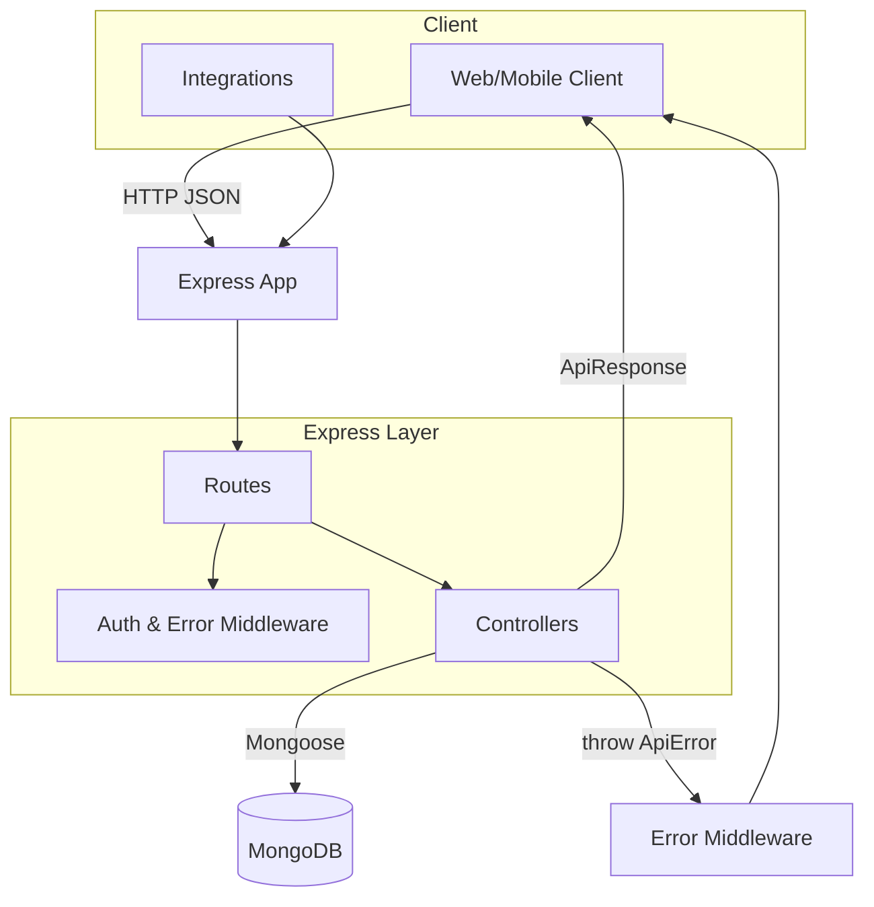
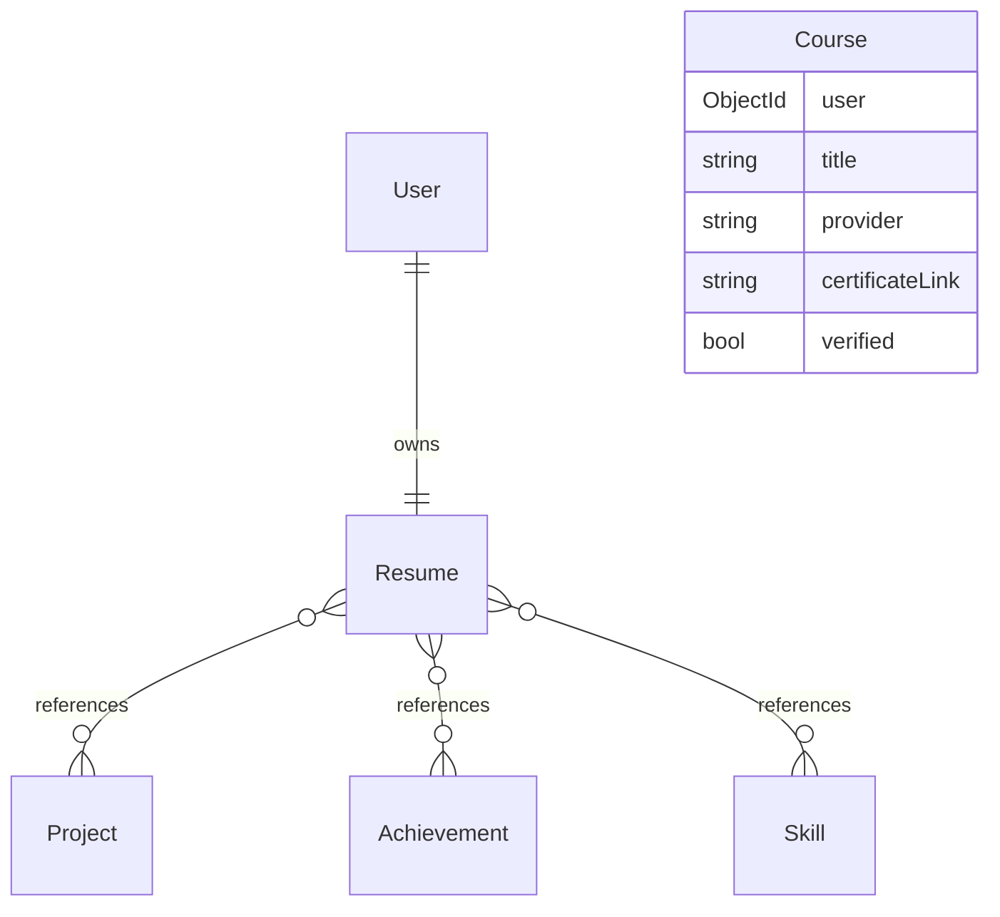
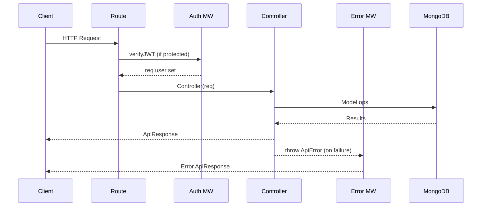

## System Architecture – Resume System

This document provides a deeper dive into the architecture, component responsibilities, and operational flows of the Resume System backend.

### Overview
The service is a stateless REST API. Controllers orchestrate validation and model operations, while centralized error and response utilities standardize outputs. MongoDB persists documents with Mongoose models.



### Components
- `index.js`: Initializes Express, applies middlewares, connects to DB, mounts routes, and starts the server.
- `DB/database-config.js`: Reads connection params from environment and connects to MongoDB.
- `middlewares/auth.middleware.js`: Validates JWT, loads `req.user`.
- `middlewares/error.middleware.js`: Standardizes error responses.
- `utils/api-error.js`: Custom error class with status and metadata.
- `utils/api-response.js`: Standard success response shape.
- `utils/async-handler.js`: Wraps async controllers to pipe errors.

### Model Relationships


### Request Lifecycle


### Authentication and Authorization
Flow
1. Login with email/password → server sets httpOnly cookie `accessToken` (JWT, `7d`).
2. Client sends the cookie automatically on subsequent requests (with credentials enabled).
3. `verifyJWT` reads the token from cookies, verifies signature, and populates `req.user`.
4. Extend with role checks (`admin`, `student`) as needed per route.

Security Notes
- Hashing via `bcryptjs` on `userSchema.pre('save')`.
- Token created via `user.generateToken()` using `jsonwebtoken`.

### Resume Auto-Update
Controllers for `Project`, `Achievement`, and `Skill` ensure `Resume` stays in sync:
- On create: `$push` item `_id` and `$set` `updatedAt`.
- On delete: `$pull` item `_id` and `$set` `updatedAt`.
- On item update: `$set` resume `updatedAt` to reflect freshness.

### Insights Computation
`GET /api/resume/stats` runs parallel queries for Projects, Achievements, and Skills, then computes counts and verified subsets in-memory. For large datasets, consider aggregation pipelines.

### Error Handling Strategy
- Throw `ApiError` for expected failures (validation, not found, unauthorized).
- Unhandled errors fall back to a generic 500 via `errorMiddleware`.
- All success responses use `ApiResponse` for consistency.

### API Surface (By Module)
- Auth: `/api/auth/register`, `/api/auth/login`
- Projects: `/api/projects` (POST/GET), `/api/projects/:projectId` (PUT/DELETE)
- Achievements: `/api/achievements` (POST/GET), `/api/achievements/:achievementId` (PUT/DELETE)
- Skills: `/api/skills` (POST/GET), `/api/skills/:skillId` (PUT/DELETE)
- Resume: `/api/resume` (GET), `/api/resume/summary` (PUT), `/api/resume/education` (PUT), `/api/resume/experience` (PUT), `/api/resume/stats` (GET)
- Verification: `/api/verify/:type/:id` (PUT)

### Deployment Considerations
- Enable CORS with allowlist in production
- Use HTTPS and secure cookie settings if using cookies
- Configure environment variables (`PORT`, `DB_URL`, `DB_Name`, `JWT_SECRET`)
- Health check route at `GET /`

### Docker Operations (Local Development)
Using Docker Compose to run backend + MongoDB locally.

Environment
```
PORT=5000
DB_URL=mongodb://mongo:27017
DB_Name=ResumeSys
JWT_SECRET=supersecretkey
```

Commands and expected outputs
```
# Build images
docker compose build
# Expect successful build without errors

# Start stack (detached)
docker compose up -d
# Expect containers: resumesys-backend, resumesys-mongo (status Up)

# Inspect running containers
docker ps
# Expect port mappings 5000->5000 and 27017->27017

# Tail backend logs
docker logs -f resumesys-backend
# Expect:
# App listening at 5000
# Connected to ResumeSys

# Probe base route
curl http://localhost:5000/
# Expect: health string response

# Stop stack
docker compose down
```

Notes
- The backend uses the `mongo` hostname to reach the DB container.
- To switch to Atlas, set `DB_URL` to the Atlas connection string; no other compose changes required.

### Future Extensions
- Role-specific verification authorization and audit trail
- Aggregation pipelines for insights and leaderboards
- Background jobs for external platform sync (Udemy, Coursera, GitHub)
- Caching layer for popular resume reads


